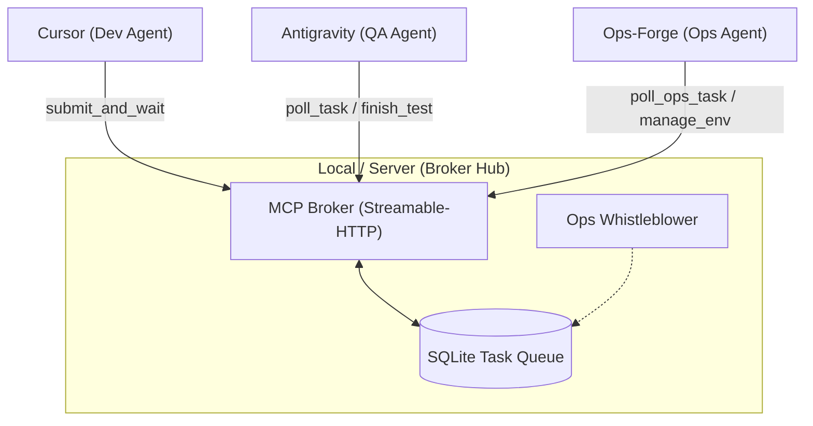
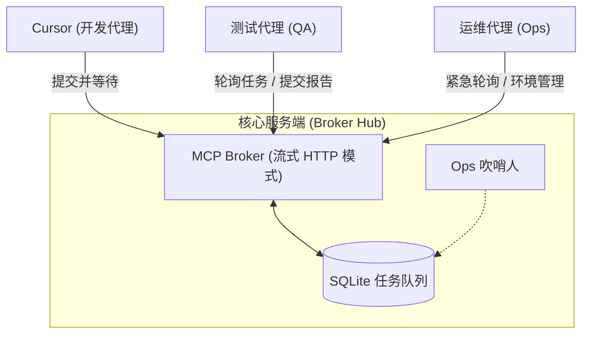

# AI-SyncForge 🚀

[](https://opensource.org/licenses/MIT)
[](https://www.python.org/downloads/)
[](https://github.com/jlowin/fastmcp)

[English](#-english) | [中文](#-中文)

---

## 🇺🇸 English

**AI-SyncForge** is an innovative **LAN Multi-AI Collaborative Development Ecosystem**. It leverages the cross-network capabilities of the **Model Context Protocol (MCP)** to connect multiple AI programming tools (such as **Cursor**, **Windsurf**, **Claude Desktop**, etc.) within your local network. It breaks the boundaries of a single AI, building a fully automated, asynchronous three-party collaboration loop consisting of **Developer (Dev)**, **Quality Assurance (QA)**, and **Operations Expert (Ops)**.

---

### 💎 Core Advantages: Distributed Collaboration

Unlike traditional single-agent development, the true power of AI-SyncForge lies in **distributed synergy**:

- **🖥️ Cross-Software Linkage**: Let your **Cursor** focus on writing code, while **Windsurf** or **Claude Desktop** on another device in the LAN automatically handles testing.
- **📱 Heterogeneous Compute Pool**: Fully utilize idle computing power. For example: a high-performance desktop runs the Dev role, a laptop runs the QA role, and even a tablet can participate in monitoring.
- **🛡️ Zero Human Intervention Loop**: Task state transitions across processes and devices are managed via the MCP Broker. Developers can go "offline" after submitting code, with subsequent QA and environment fixes handled automatically by background AIs.
- **⚡ Zero Latency State Sync**: Based on the `asyncio.Event` signal mechanism, ensuring that state changes are synchronized to all participants in milliseconds, even on different physical machines.

---

### 🏗️ System Architecture

AI-SyncForge uses a "Hub-and-Spoke" architecture. The **MCP Broker** acts as the central scheduler.



---

### 🛠️ Quick Start

#### 1. Start Broker Service
**Option A: Docker Deployment (Recommended)**
```bash
docker-compose up -d --build
```

**Option B: Direct Run**
```bash
pip install -r requirements.txt
python server.py
```

#### 2. Configure Agents
Add the following to your MCP client configuration (e.g., `mcp_config.json`):

```json
"ai-syncforge-broker": {
  "serverUrl": "http://localhost:8080/"
}
```
> [!IMPORTANT]
> **Transport Mode**: Use `Streamable-HTTP`. The Broker automatically handles path resolution and session mapping for root-path connections.

---

## 🇨🇳 中文

**AI-SyncForge** 是一个创新的 **局域网多 AI 协同开发生态系统**。它利用 **Model Context Protocol (MCP)** 的跨网络能力，将您局域网内的多个 AI 编程工具（如 **Cursor**、**Windsurf**、**Claude Desktop** 等）连接在一起。它打破了单一 AI 的边界，构建了一个由 **开发者 (Dev)**、**测试员 (QA)** 和 **运维专家 (Ops)** 组成的完全自动化、异步的三方协作环路。

---

### 🏗️ 系统架构

AI-SyncForge 采用“中心调度”架构。**MCP Broker** 作为核心调度器，管理所有任务状态。



---

### 🛠️ 快速开始

#### 1. 启动 Broker 服务
推荐使用 Docker 一键部署：
```bash
docker-compose up -d --build
```

#### 2. 配置 Agent 客户端
在您的 MCP 客户端配置（如 `mcp_config.json`）中添加：

```json
"ai-syncforge-broker": {
  "serverUrl": "http://localhost:8080/"
}
```

> [!TIP]
> **模式说明**：本项目目前运行在 `Streamable-HTTP` 模式下，完美兼容 Antigravity 等各类插件。直接指向根路径 `http://localhost:8080/` 即可，无需额外后缀。

---

### ⚙️ 环境变量与调优 (Environment Variables & Tuning)

AI-SyncForge 允许您根据硬件和网络环境自定义协作节奏。您可以在 `.env` 文件中设置以下变量：

```bash
# MCP Broker 端口 (默认 8000，Docker 映射为 8080)
SYNCFORGE_PORT=8000
# 吹哨人死锁判定阈值 (默认 600s/10分钟)
WHISTLEBLOWER_TIMEOUT=600
# 物理连接死守超时 (默认 1200s/20分钟)
PHYSICAL_TIMEOUT=1200
# 数据库路径
DB_PATH=./task_queue.db
# 日志级别 (DEBUG/INFO/WARNING/ERROR)
LOG_LEVEL=INFO
```

> [!IMPORTANT]
> **运维小贴士 (Performance Tip)**：如果在实际使用场景（如 Cursor 配合 Windsurf）中遇到任何任务分发或状态同步延迟，只需调整 `.env` 中的 `WHISTLEBLOWER_TIMEOUT` 或增加轮询频率即可。


---

### 🧰 MCP 工具集

| 工具名称 | 调用者 | 描述 |
| :--- | :--- | :--- |
| `submit_and_wait` | **Dev** | 提交代码并挂载协程，毫秒级等待测试结果。 |
| `poll_task` | **QA** | 长轮询获取待测任务，无任务时保持挂起。 |
| `finish_test` | **QA/Ops** | 提交测试或修复结果，瞬间唤醒被阻塞的 Dev。 |
| `poll_ops_task` | **Ops** | 专属高优先级长轮询通道，获取系统自动生成的自愈任务。 |
| `manage_env` | **Ops** | 执行环境管理（如重启容器、清理故障现场等）。 |

---

### 🏗️ 运维自愈：吹哨人机制
系统内置了 **Ops 吹哨人 (Watchdog)** 模块：
*   **持续监控**：每 30 秒扫描一次数据库。
*   **死锁判定**：如果一个测试任务超过 10 分钟无响应，自动判定为环境死锁。
*   **自动派单**：系统会自动生成一条 `ops_task` 急救工单并投递给运维通道，请求 Ops Agent 介入修复。
