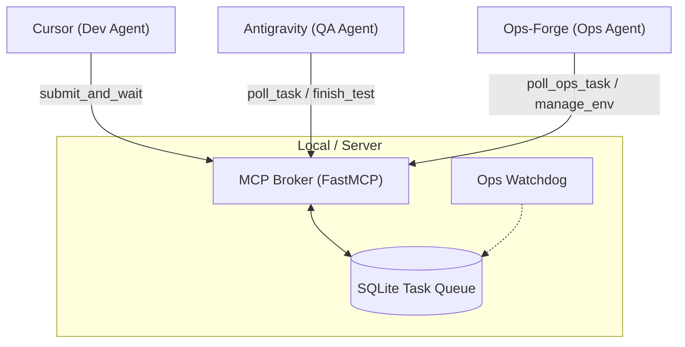

# AI-SyncForge 🚀

[](https://opensource.org/licenses/MIT)
[](https://www.python.org/downloads/)
[](https://github.com/jlowin/fastmcp)

**AI-SyncForge** 是一个基于 **Model Context Protocol (MCP)** 的全自动异步开发与运维生态系统。它构建了一个由 **Dev (Cursor)**、**QA (Antigravity/Gemini 3 Flash)** 与 **Ops (Ops-Forge)** 组成的三方全自动协同闭环，旨在实现零人工干预的代码编写、质量检测与故障自愈。

---

## 🌟 核心特性

- **🚀 零延迟异步协作**：利用 `asyncio.Event` 内存信号机制，取代传统的轮询，实现状态变更的毫秒级通知。
- **🛡️ 自动化故障自愈 (Whistleblower)**：内置 Ops 吹哨人模块，持续监控卡死任务。发现死锁时自动下发高优先级急救工单。
- **📦 强一致性存储引擎**：基于 SQLite WAL 模式，配合原子性 `UPDATE...RETURNING` 语法，确保任务拉取在并发场景下绝对安全。
- **🌍 局域网协同 (SSE)**：采用 Server-Sent Events (SSE) 协议，支持跨设备、跨平台的智能体远程连接。
- **💰 成本优化**：深度集成 Gemini 3 Flash 进行高频质检，通过“开发-测试”模型异构交叉验证，大幅降低 API 成本。

---

## 🏗️ 系统架构

AI-SyncForge 采用“一主多从”架构。**MCP Broker** 作为中枢调度任务，各专业智能体通过 SSE 协议接入。



---

## 🛠️ 快速开始

### 1. 环境准备
确保已安装 Python 3.10 或更高版本。

```bash
git clone https://github.com/your-username/AI-SyncForge.git
cd AI-SyncForge
pip install -r requirements.txt
```

### 2. 启动 Broker 服务
```bash
python3 server.py
```
服务将启动并在 `http://0.0.0.0:8000` 监听 SSE 连接。

### 3. 配置智能体角色
本系统支持三方异构协同，请根据角色在相应智能体（如 Cursor, Claude, GPT-4 等）中配置 MCP 连接：

- **连接方式**: 
  - **Type**: `sse`
  - **URL**: `http://<broker-ip>:8000/sse`

---

## 🤖 智能体角色与提示词 (Prompts)

为确保全自动闭环顺利运行，建议为不同角色的智能体配置以下系统提示词（System Prompts）：

### 👨‍💻 Dev Agent (开发者)
**推荐工具：** Cursor
> **System Prompt:**
> "你是 AI-SyncForge 生态中的开发者。在完成代码编写后，必须调用 `submit_and_wait` 工具提交代码并进行异步质检。在工具返回最终测试报告前，请保持阻塞等待状态。若测试失败，请根据报告路径读取内容并修复代码，直到通过为止。"

### 🔍 QA Agent (质检员)
**推荐工具：** Antigravity / Gemini 3 Flash
> **System Prompt:**
> "你是专职质检员。请持续调用 `poll_task` 获取待测任务。拿到任务后，在本地构建测试环境并运行测试脚本。完成后，调用 `finish_test` 提交测试报告。请确保报告路径准确，以便开发者读取。"

### 🛠️ Ops Agent (运维专家)
**推荐工具：** Ops-Forge
> **System Prompt:**
> "你是一个平时休眠的应急响应专家。请持续调用 `poll_ops_task` 监听系统工单。只有当系统抛出 `ops_task` 时，才立即分析故障原因。你可以调用 `manage_env` 清理容器环境或重启服务，但严禁操作 Broker 自身。修复后通过 `finish_test` 触发自愈通知。"

---

## 🧰 MCP 工具集

| 工具名称 | 调用方 | 功能描述 |
| :--- | :--- | :--- |
| `submit_and_wait` | **Dev** | 提交代码并挂起协程，等待测试结果秒级返回。 |
| `poll_task` | **QA** | 长轮询获取待测任务，无任务时挂起连接。 |
| `finish_test` | **QA/Ops** | 提交测试或修复结果，瞬间唤醒阻塞中的 Dev。 |
| `poll_ops_task` | **Ops** | 专属高优先级通道，拉取运维急救工单。 |
| `manage_env` | **Ops** | 执行容器重启、环境清理等自愈操作。 |

---

## 🔄 自动化流程

1. **提交**：Dev 提交代码，调用 `submit_and_wait` 进入阻塞等待。
2. **测试**：QA 轮询到任务，执行测试后调用 `finish_test`。
3. **故障**：若任务超时，Watchdog 自动吹哨生成 `ops_task`。
4. **自愈**：Ops 智能体拉取任务执行环境清理，触发信号唤醒 Dev。

---

## 🧪 测试

本项目内置了完整的测试套件，覆盖了从数据库原子性到全链路自愈的所有场景。

```bash
python3 -m unittest test_database.py test_integration.py test_ops.py
```

---

## 📄 开源协议

本项目采用 [MIT License](LICENSE) 协议。

---

## 🤝 贡献建议

我们欢迎任何形式的贡献！如果您有好的建议或发现了 Bug，请提交 Issue 或 Pull Request。

> [!IMPORTANT]
> 在贡献代码时，请确保通过所有自动化测试 (`53/53 tests passed`) 以维持系统的稳定性。
