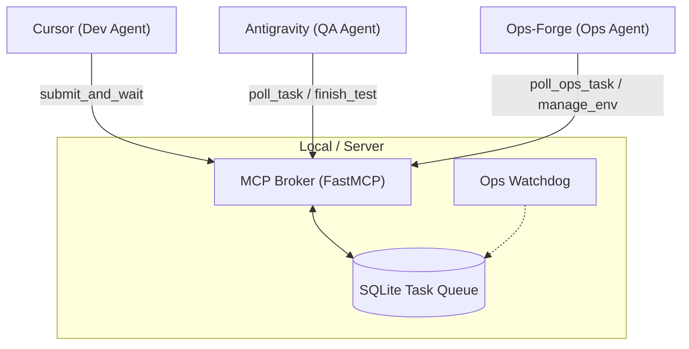

# AI-SyncForge 🚀

[](https://opensource.org/licenses/MIT)
[](https://www.python.org/downloads/)
[](https://github.com/jlowin/fastmcp)

**AI-SyncForge** 是一个创新的 **局域网多 AI 协同开发生态**。它利用 **Model Context Protocol (MCP)** 的跨网络特性，将您局域网内的多个 AI 编程工具（如 **Cursor**、**Windsurf**、**Claude Desktop** 等）联结在一起，打破单一 AI 的能力边界，构建一套由 **开发者 (Dev)**、**质检员 (QA)** 与 **运维专家 (Ops)** 组成的三方全自动异步协作闭环。

---

## 💎 核心优势：局域网多机协同

与传统的单智能体开发不同，AI-SyncForge 的真正力量在于**分布式协同**：

- **🖥️ 跨软件联动**：让你的 **Cursor** 专门负责写代码，而让局域网另一台设备上的 **Windsurf** 或 **Claude Desktop** 自动负责跑测试。
- **📱 异构设备算力池**：充分利用闲置算力。例如：高性能主机运行 Dev 角色，笔记本挂机运行 QA 角色，甚至平板设备也能参与监控。
- **🛡️ 零人工干预闭环**：通过 MCP Broker 实现跨进程、跨设备的任务状态流转，开发者提交代码后即可“离线”，后续的质检与环境修复完全由后台 AI 自动完成。
- **🌐 跨地域云协同**：配合 **Tailscale** 或 **ZeroTier** 等虚拟局域网工具，您可以轻松实现跨地域的设备联动（例如：家里的电脑写代码，公司的服务器跑测试）。
- **⚡ 零延迟状态同步**：基于 `asyncio.Event` 信号机制，确保即便在不同物理机上，状态变更也能在毫秒级同步到所有参与者。

---

## 🌟 关键特性


- **🚀 零延迟异步协作**：利用 `asyncio.Event` 内存信号机制，取代传统的轮询，实现状态变更的毫秒级通知。
- **🛡️ 自动化故障自愈 (Whistleblower)**：内置 Ops 吹哨人模块，持续监控卡死任务。发现死锁时自动下发高优先级急救工单。
- **📦 强一致性存储引擎**：基于 SQLite WAL 模式，配合严格的 `RETURNING` 原子锁语法。我们在底层的 `get_pending_task` 和 `poll_ops_task` 中彻底锁死了高并发环境下的重复接单和竞态风险，确保多实例部署下的绝对安全。
- **🌍 局域网协同 (SSE)**：采用 Server-Sent Events (SSE) 协议，支持跨设备、跨平台的智能体远程连接。
- **💰 成本优化**：深度集成 Gemini 3 Flash 进行高频质检，通过“开发-测试”模型异构交叉验证，大幅降低 API 成本。

---

## 🏗️ 系统架构

AI-SyncForge 采用“一主多从”架构。**MCP Broker** 作为中枢调度任务，各专业智能体通过 SSE 协议接入。



---

## 🛠️ 快速开始

### 1. 环境准备
确保已安装 Python 3.10 或更高版本。
> [!NOTE]
> 本项目依赖 SQLite 3.35.0+ (发布于 2021-03) 以支持 `RETURNING` 原子语法。大多数现代 Linux 发行版（如 Ubuntu 20.04+, Debian 11+）均已内置支持。

```bash
git clone https://github.com/your-username/AI-SyncForge.git
cd AI-SyncForge
pip install -r requirements.txt
```

### 2. 启动 Broker 服务
#### 方式 A: 直接运行
```bash
python3 server.py
```

#### 方式 B: Docker 部署 (推荐)
```bash
docker-compose up -d
```
> [!TIP]
> Docker 部署模式下，数据库文件将持久化在 `./data` 目录下，并自动加载 `.env` 中的配置。

---

⚙️ **环境变量配置 (可选)**

AI-SyncForge 允许您根据硬件算力和网络环境自定义协同节奏。您可以在运行前设置以下环境变量，或在根目录创建 `.env` 文件：

```bash
# MCP 桥接服务端口 (默认 8000)
SYNCFORGE_PORT=8000
# 运维吹哨人死锁判定时间 (默认 600秒/10分钟)
WHISTLEBLOWER_TIMEOUT=600
# 开发者物理断开兜底时间 (默认 1200秒/20分钟)
PHYSICAL_TIMEOUT=1200
# 数据库挂载路径
DB_PATH=./task_queue.db
# 日志级别 (DEBUG/INFO/WARNING/ERROR)
LOG_LEVEL=INFO
```

### 3. 配置智能体角色
本系统支持三方异构协同，请根据角色在相应智能体（如 Cursor, Claude, GPT-4 等）中配置 MCP 连接：

- **连接方式**: 
  - **Type**: `sse`
  - **URL**: `http://<broker-ip>:8000/sse`

---

## 🤖 智能体角色与提示词 (Prompts)

为确保全自动闭环顺利运行，建议为不同角色的智能体配置系统提示词（System Prompts）。

我们提供了两种配置方案：
1. **分布式工作区**：适用于多机协作，提示词包含完整代码传递。
2. **统一工作区**：适用于单机同目录协作，基于文件路径进行极简通讯。

👉 **[点击查看详细的智能体角色与提示词指南](./PROMPTS.md)**

---

---

## 🧰 MCP 工具集

| 工具名称 | 调用方 | 功能描述 |
| :--- | :--- | :--- |
| `submit_and_wait` | **Dev** | 提交代码并挂起协程，等待测试结果秒级返回。 |
| `poll_task` | **QA** | 长轮询获取待测任务，无任务时挂起连接。 |
| `finish_test` | **QA/Ops** | 提交测试或修复结果，瞬间唤醒阻塞中的 Dev。 |
| `poll_ops_task` | **Ops** | 专属高优先级长轮询通道，利用原子锁安全拉取运维急救工单。 |
| `manage_env` | **Ops** | 执行容器重启、环境清理等自愈操作。 |

---

## 🏗️ 用户体验流程 (User Experience Journey)

AI-SyncForge 模拟了真实的团队协作，您只需启动中枢并扮演“总导演”角色：

1.  **中枢就绪**：在一台具备公网或局域网 IP 的机器上启动 `server.py` (Broker)。
2.  **激活团队**：
    *   在 **QA 编程软件** (如 Windsurf) 中发一句：“*开始工作，持续监听任务。*”
    *   在 **Ops 编程软件** (如 Claude Desktop) 中发一句：“*开始工作，时刻准备应急响应。*”
3.  **下达方案**：您将完整的技术方案交给 **Dev 编程软件** (如 Cursor)，并下令：“*按照此方案执行，每完成一个小模块就调用 submit_and_wait 提交测试。*”
4.  **小步快跑，自动协同**：
    *   **Dev** 按照方案拆解任务，编写第一块代码并自动提交。
    *   **QA** 瞬间感知任务并执行测试，测试通过后反馈给 Dev。
    *   **Dev** 收到通过信号，继续编写下一块代码。
5.  **应急响应 (隐藏驱动)**：
    *   **吹哨人 (Watchdog)**：Broker 内部有一个静默运行的监控协程。如果 QA 任务因为容器挂掉或死锁而超过 10 分钟无响应，吹哨人会自动在数据库生成一个高优先级的 **Ops 急救任务**。
    *   **Ops 介入**：此时一直通过 `poll_ops_task` 待命的 **Ops Agent** 会立即接到这个急救任务，分析并调用 `manage_env` 修复环境，最后通过信号通知 Dev 重试。
6.  **最终交付**：所有方案内容全部完成后，**Dev** 会停止迭代，并向您汇报整套方案的最终执行结果。

---

## 🔄 自动化流程

1. **提交**：Dev 提交代码，调用 `submit_and_wait` 进入阻塞等待。
2. **测试**：QA 轮询到任务，执行测试后调用 `finish_test`。
3. **监控 (Whistleblower)**：Watchdog 扫描到 `testing` 状态任务超时 10min -> 自动生成 `ops_task` (priority=999)。
4. **急救 (Rescue)**：Ops Agent 通过 `poll_ops_task` 拿到工单 -> 执行 `manage_env` -> `finish_test` 唤醒 Dev。
5. **闭环**：Dev 接收结果，继续下一模块开发。

---

## 🧪 测试

本项目内置了完整的测试套件，覆盖了从数据库原子性到全链路自愈的所有场景。

```bash
python3 -m unittest test_database.py test_integration.py test_ops.py
```

---

## 📄 开源协议

本项目采用 [MIT License](LICENSE) 协议。

---

## 🤝 贡献建议

我们欢迎任何形式的贡献！如果您有好的建议或发现了 Bug，请提交 Issue 或 Pull Request。

> [!IMPORTANT]
> 在贡献代码时，请确保通过所有自动化测试 (`53/53 tests passed`) 以维持系统的稳定性。
